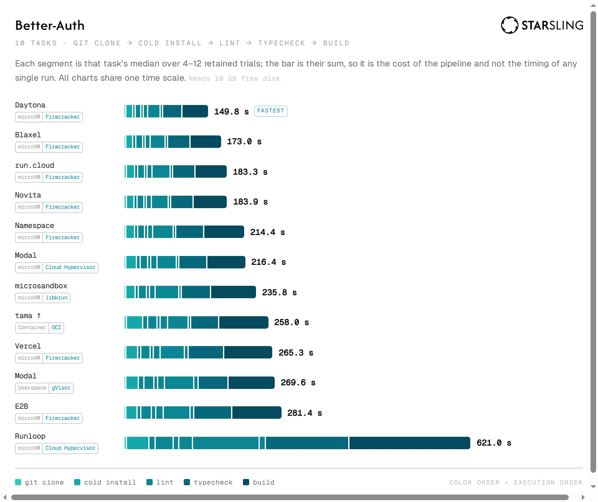

<div align="center">

# High-Performance Sandbox Benchmarks

**Compare top sandbox providers on the same target hardware shape for real developer and CI/CD workloads.**

[Leaderboard](./LEADERBOARD.md) · [Methodology](./docs/methodology.md) · [Dataset](./data/dataset/) · [Architecture](./docs/architecture.md) · [Contributing](./CONTRIBUTING.md)

4 vCPU · 8 GiB RAM · 40 GB disk



</div>


## Why real-world workflows?

We measure the end-to-end time that developers and agents actually experience when using a sandbox to complete software engineering tasks. Going from a ticket to a PR is a multi-phase workflow - clone a repo, install dependencies, lint, build, test, etc. 
 
A sandbox provider can top a creation time or CPU performance chart and still lose badly on:
- dependency installation is thousands of small, random file writes, and a network-attached
or bandwidth-capped disk turns that into the longest step of your run.
- cloning a repo has the opposite profile: mostly sequential writes, bounded by network.
- single-threaded developer tools are limited by single-thread CPU not threads
- isolation technology and in-sandbox Docker capability

## Why follow OpenBenchmarking for synthetics?

Our synthetic benchmarks use versioned [Phoronix Test Suite](https://github.com/phoronix-test-suite/phoronix-test-suite) profiles published through [OpenBenchmarking.org](https://openbenchmarking.org/), the long-standing standard for Linux hardware and software benchmarking.

Each workload has an inspectable definition for installation, arguments, repetition, parsing, units, and result direction, and can be reproduced independently outside this repository. The profiles are vendored, their metric definitions are generated rather than transcribed, and [CI rejects drift](./docs/adr/0003-generated-pts-catalog-and-drift-gate.md). Custom instrumentation is limited to measurements PTS cannot represent: provider lifecycle latency, sandbox capabilities, pricing, and complete developer workflows. Those workflows are authored as repo-local PTS profiles, so first-party workloads inherit the same execution and parsing model as upstream benchmarks.

## Methodology

Each result is produced from fresh, independently created sandboxes. Workloads, toolchains,
arguments, and target resources are pinned; raw samples and observed machine properties are retained;
normalized runs are schema-validated before publication.

Within-sandbox passes and between-sandbox replicates are tracked separately. Failed, missing,
unsupported, and resource-mismatched results are disclosed rather than treated as zero or silently
excluded.

Read the full [methodology](./docs/methodology.md).

## Development

```bash
mise install                     # pinned non-Bun tools (typos, shellcheck, hadolint)
bun install --frozen-lockfile
bun run typecheck
bun run test
bun run lint
```

The full command contract, workspace layout, and enforced dependency DAG are in
[Architecture](./docs/architecture.md).

Provider benchmarks, dataset publication, and toolchain releases require protected credentials and
run only from maintainer-controlled workflows; pull requests never receive provider secrets. See
[CI & secrets](./docs/ci-secrets.md).

## Contributing

Contributions must preserve three invariants:

1. Every provider performs equivalent work.
2. Every number is traceable to raw samples and exact workload provenance.
3. Missing or non-comparable results remain visible.

See [CONTRIBUTING.md](./CONTRIBUTING.md) and [SECURITY.md](./SECURITY.md).
